#IKNOW #ITS #A #ONE #FAIL! #SORRY #IHAVE #MOMENTLY #NO ~ #TIME #FOR #THIS
#I #BECOME #THAT #FIX 
#NO #PROBLEM!.

#ISEETHIS #IN #LOG!

#ITS #BETTER! #COME #BY #UPDATE! AND #UPGRADE!

#SORRY #FOR #THIS #COMMIT 

#REKORD!. :)

# 🌟 EU/UN Ethik & Compliance Framework
## *Ein wissenschaftlicher Blueprint für digitale Verantwortung mit GitHub Spark Integration*

<div align="center">


### 🏛️ **Projektfamilie**
**StatesFlowWishes** · **HNOSS** · **HouseOrdnung** · **Prismatahrion**


</div>

---

> *„Ordnung ist Sternenlicht im Code: Jede Datei ein kleines Gesetz des Guten."*  
> **Kein Consent → kein Content. Jede Antwort mit Herkunft & Hash. Fail-closed statt Wunschdenken.**

<div align="center">

## 🎯 **Interaktive Compliance-Matrix**
*Wissenschaftliche Meta-Signale für strukturierte Evidenzen*

</div>

<table width="100%" cellpadding="10">
<tr>
<td align="center" width="25%">
<h3>🇪🇺 <strong>Europäische Union</strong></h3>
<div style="background: linear-gradient(135deg, #0066cc, #004499); border-radius: 15px; padding: 15px; margin: 10px;">

[](./compliance/EU_AI_ACT.md)
[](./compliance/GDPR.md)
[](./compliance/NIS2.md)
[](./compliance/CRA.md)

<details>
<summary><strong>📊 Progress Tracker</strong></summary>

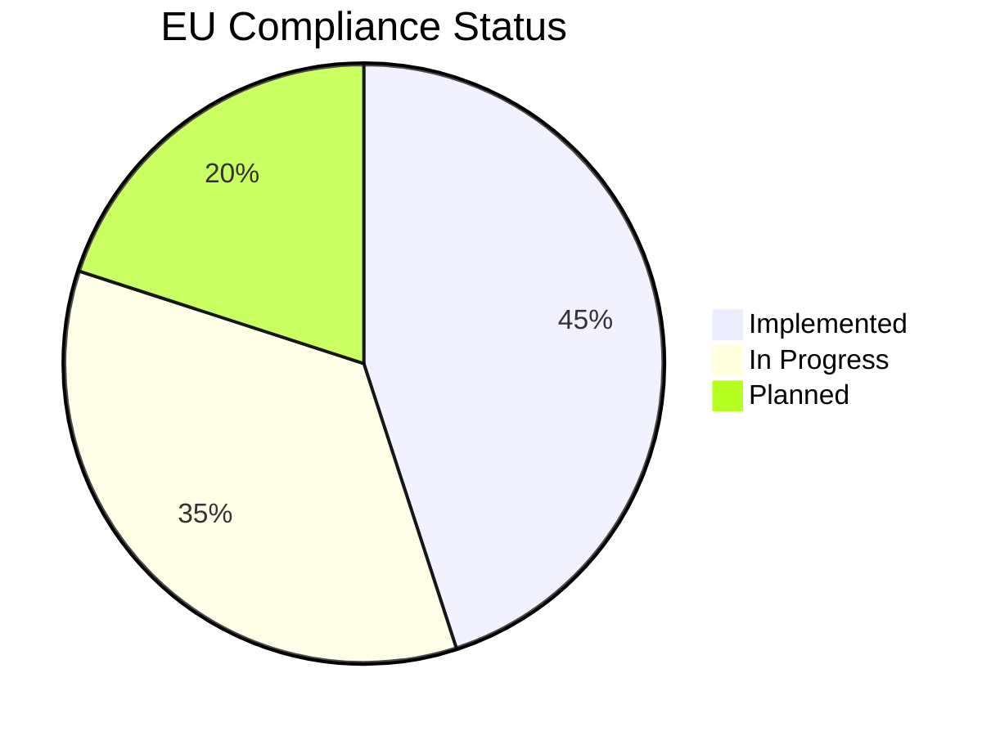

- **✅ Completed:** GDPR Art. 5-6, Basic CRA
- **🔄 In Progress:** EU AI Act Mapping
- **📋 Planned:** NIS2 Full Implementation

</details>

</div>
</td>

<td align="center" width="25%">
<h3>🇩🇪 <strong>Deutschland</strong></h3>
<div style="background: linear-gradient(135deg, #000000, #dd0000, #ffcc00); border-radius: 15px; padding: 15px; margin: 10px;">

[](./compliance/GRUNDGESETZ.md)
[](./compliance/BGB.md)
[](./compliance/BDSG.md)

<details>
<summary><strong>🎯 Rechtliche Kontrollen</strong></summary>

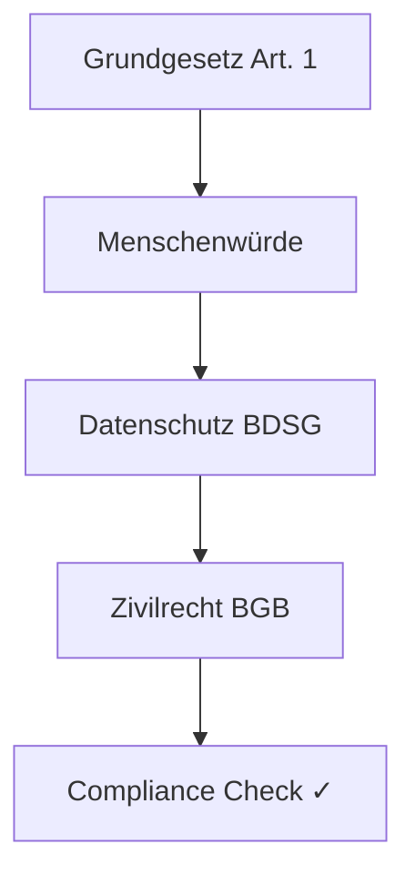

- **Menschenwürde:** Kern aller Implementierungen
- **Datenschutz:** BDSG + GDPR harmonisiert
- **Zivilrecht:** Vertragliche Absicherung

</details>

</div>
</td>

<td align="center" width="25%">
<h3>🌍 <strong>International</strong></h3>
<div style="background: linear-gradient(135deg, #1e3c72, #2a5298); border-radius: 15px; padding: 15px; margin: 10px;">

[](./compliance/UN_UDHR.md)
[](./compliance/WIPO.md)
[](./compliance/EPO.md)
[](./compliance/NIST.md)

<details>
<summary><strong>🌐 Global Standards</strong></summary>

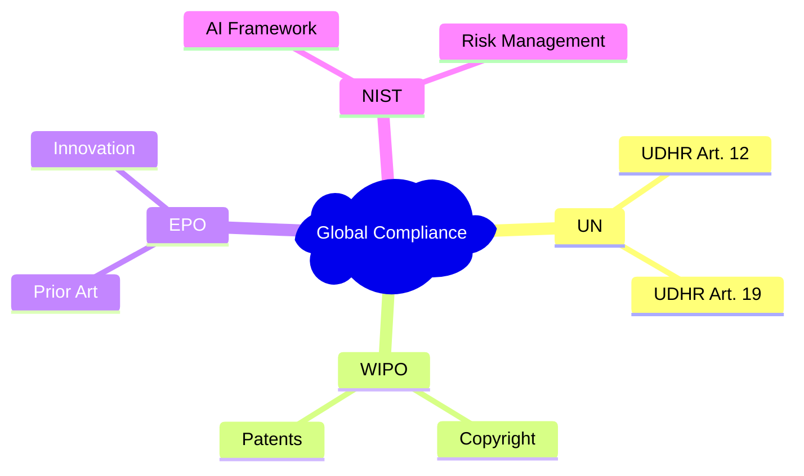

</details>

</div>
</td>

<td align="center" width="25%">
<h3>🚀 <strong>GitHub Spark</strong></h3>
<div style="background: linear-gradient(135deg, #24292e, #0366d6); border-radius: 15px; padding: 15px; margin: 10px;">

[](https://github.com/spark)
[](./docs/VSCODE_INTEGRATION.md)
[](./.github/workflows/docs-build.yml)
[](./workspace.code-workspace)

<details>
<summary><strong>🔄 Integration Flow</strong></summary>

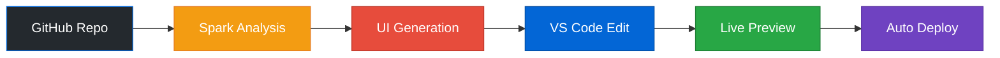

</details>

</div>
</td>
</tr>
</table>

---

<div align="center">

## 🔒 **Meta-Qualitätssiegel & Interaktive Controls**

<table>
<tr>
<td align="center">

[](#präambel--werte)
[](#transparenz-herkunft--hash)

</td>
<td align="center">

[](#governance-dokumente)
[](#governance-dokumente)

</td>
</tr>
</table>

### 🎮 **Interaktive Navigation**

<a href="#präambel--werte"><kbd> <br> 🏛️ Präambel <br> </kbd></a>&nbsp;&nbsp;
<a href="#geltungsbereich--referenzen"><kbd> <br> 📋 Geltungsbereich <br> </kbd></a>&nbsp;&nbsp;
<a href="#compliance-mapping"><kbd> <br> ⚖️ Compliance <br> </kbd></a>&nbsp;&nbsp;
<a href="#repository-register-ethik--menschenrechte"><kbd> <br> 📚 Repository <br> </kbd></a>&nbsp;&nbsp;
<a href="#governance-dokumente"><kbd> <br> 🏛️ Governance <br> </kbd></a>&nbsp;&nbsp;
<a href="#risikoregister-aidata"><kbd> <br> ⚠️ Risiken <br> </kbd></a>

</div>

---

<details open>
<summary><h2>📖 <strong>Wissenschaftliches Inhaltsverzeichnis</strong> (Expandable)</h2></summary>

```markdown
📑 STRUKTUR-ÜBERSICHT

├── 🏛️ [Präambel & Werte](#präambel--werte)
│   ├── Consent-First Prinzip
│   ├── Herkunft & Hash Verification
│   └── Fail-Closed Security Model
│
├── 📋 [Geltungsbereich & Referenzen](#geltungsbereich--referenzen)
│   ├── Jurisdiktionsmatrix
│   ├── Rechtliche Quellen
│   └── Internationaler Kontext
│
├── ⚖️ [Compliance-Mapping](#compliance-mapping)
│   ├── 🇪🇺 [EU Regulierung](#eu)
│   │   ├── EU AI Act (Art. 3, 5, 6)
│   │   ├── GDPR (Art. 5, 6, 9)
│   │   ├── NIS2 (Ops/Sec Controls)
│   │   └── CRA (Security by Design)
│   ├── 🇩🇪 [Deutschland](#deutschland)
│   │   ├── Grundgesetz (Art. 1)
│   │   ├── BGB (Zivilrechtliche Bezüge)
│   │   └── BDSG (Datenschutz)
│   ├── 🌍 [UN/International](#unmenschenrechte)
│   │   ├── UDHR (Art. 12, 19)
│   │   ├── WIPO/EPO/EPA (IP-Rights)
│   │   └── NIST AI RMF 1.0
│   └── 🚀 [GitHub Spark Integration](#github-spark)
│
├── 📚 [Repository-Register](#repository-register-ethik--menschenrechte)
│   ├── Ethik-Dokumentation
│   ├── Menschenrechts-Mapping
│   └── Compliance-Evidenzen
│
├── 🏛️ [Governance-Dokumente](#governance-dokumente)
│   ├── Model Cards
│   ├── Dataset Cards
│   └── Transparenz-Reports
│
├── ⚠️ [Risikoregister](#risikoregister-aidata)
│   ├── AI-spezifische Risiken
│   ├── Data Protection Risks
│   └── Mitigation Strategies
│
└── 🔍 [Transparenz & Verification](#transparenz-herkunft--hash)
    ├── Commit Hash Tracking
    ├── GPG Signature Verification
    └── SLSA Supply Chain Security
```

</details>

---

## 🏛️ Präambel & Werte

<div align="center">

### 🎯 **Kernprinzipien der digitalen Verantwortung**

</div>

<table width="100%">
<tr>
<td width="50%" align="center">

#### 🔐 **Consent First Architecture**
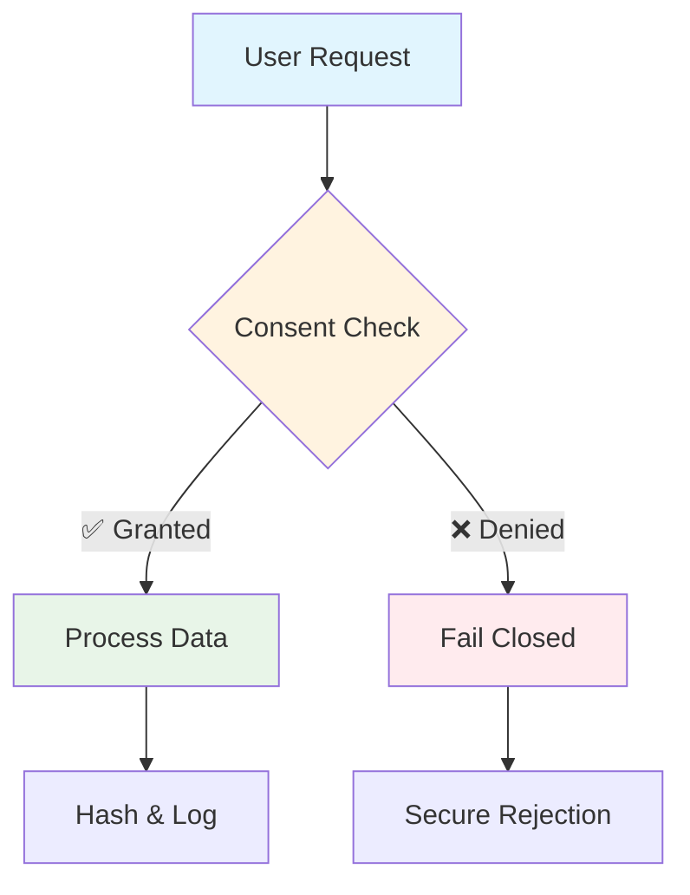

</td>
<td width="50%" align="center">

#### 🔍 **Herkunft & Hash Verification**
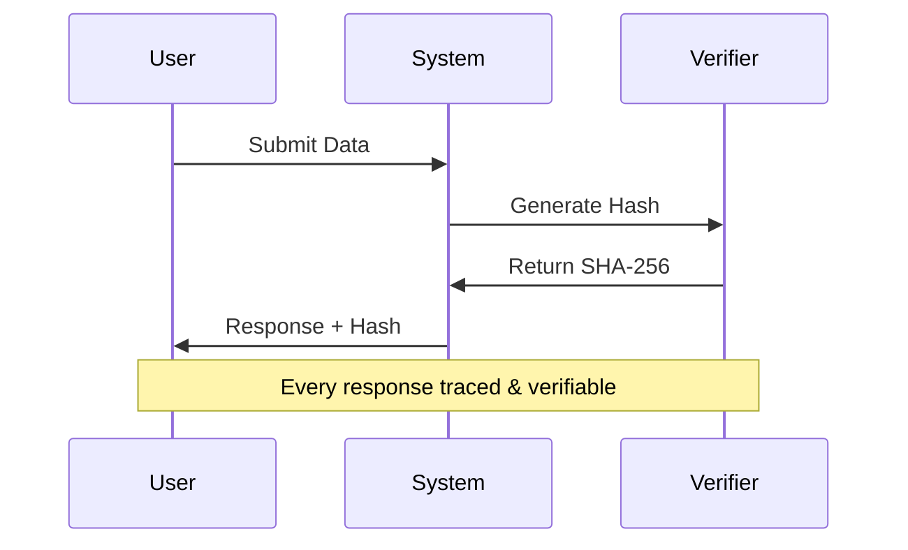

</td>
</tr>
</table>

<div align="center">

### 📋 **Implementierte Schutzmaßnahmen**

<details>
<summary><strong>🛡️ Signal-/Datenhygiene Controls</strong></summary>

- **🔒 PII-Scrubbing:** Automatische Erkennung und Anonymisierung personenbezogener Daten
- **🎯 Zweckbindung:** Datenverarbeitung nur für explizit definierte Zwecke
- **📏 Datenminimierung:** Minimal necessary data principle
- **⏰ Speicherbegrenzung:** Automatische Löschkonzepte nach definierter Retention
- **📊 Differential Privacy:** Mathematische Privacy-Garantien wo anwendbar
- **🔍 Red Teaming:** Kontinuierliche Bias-, Sicherheits- und Missbrauchstests

```python
# Beispiel: PII-Scrubbing Pipeline
class PIIScrubbingPipeline:
    def __init__(self):
        self.patterns = {
            'email': r'\b[A-Za-z0-9._%+-]+@[A-Za-z0-9.-]+\.[A-Z|a-z]{2,}\b',
            'phone': r'\+?1?-?\.?\s?\(?\d{3}\)?[\s.-]?\d{3}[\s.-]?\d{4}',
            'ssn': r'\b\d{3}-?\d{2}-?\d{4}\b'
        }
    
    def scrub(self, text):
        for pattern_name, pattern in self.patterns.items():
            text = re.sub(pattern, f'[REDACTED_{pattern_name.upper()}]', text)
        return text
```

</details>

<details>
<summary><strong>⚡ Fail-Closed Security Model</strong></summary>

**Grundprinzip:** Bei Unsicherheit oder Fehlern wird restriktiv entschieden.

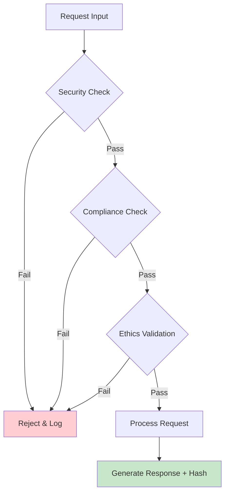

**Implementierung:**
- 🚫 **Default Deny:** Alle Anfragen standardmäßig abgelehnt bis explizit zugelassen
- 🔍 **Multi-Layer Validation:** Security → Compliance → Ethics → Processing
- 📝 **Comprehensive Logging:** Alle Ablehnungen mit Grund und Kontext geloggt
- 🔄 **Auto-Recovery:** Temporäre Fehler führen zu Retry mit exponential backoff

</details>

</div>

---

## 📋 Geltungsbereich & Referenzen

### 🌐 **Jurisdiktionsmatrix**

<table width="100%">
<tr>
<th width="20%">Jurisdiction</th>
<th width="30%">Primäre Regulierung</th>
<th width="25%">Implementierungsgrad</th>
<th width="25%">Nächste Schritte</th>
</tr>
<tr>
<td align="center">🇪🇺 <strong>EU</strong></td>
<td>EU AI Act, GDPR, NIS2, CRA</td>
<td align="center">
<div>

<br>
<progress value="65" max="100"></progress>
</div>
</td>
<td>AI Act Risk Assessment finalisieren</td>
</tr>
<tr>
<td align="center">🇩🇪 <strong>DE</strong></td>
<td>Grundgesetz, BGB, BDSG</td>
<td align="center">
<div>

<br>
<progress value="80" max="100"></progress>
</div>
</td>
<td>BDSG Harmonisierung mit GDPR</td>
</tr>
<tr>
<td align="center">🌍 <strong>UN</strong></td>
<td>UDHR, WIPO, NIST</td>
<td align="center">
<div>

<br>
<progress value="45" max="100"></progress>
</div>
</td>
<td>NIST AI RMF Implementation</td>
</tr>
</table>

### 📚 **Rechtliche Quellen & Standards**

<details>
<summary><strong>📖 Primäre Rechtsquellen</strong></summary>

#### 🇪🇺 **Europäische Union**
- **[EU AI Act](https://eur-lex.europa.eu/legal-content/EN/TXT/?uri=CELEX:32024R1689)** - Regulation 2024/1689
- **[GDPR](https://eur-lex.europa.eu/eli/reg/2016/679/oj)** - Regulation 2016/679
- **[NIS2 Directive](https://eur-lex.europa.eu/eli/dir/2022/2555/oj)** - Directive 2022/2555
- **[Cyber Resilience Act](https://eur-lex.europa.eu/legal-content/EN/TXT/?uri=CELEX:52022PC0454)** - Proposed Regulation

#### 🇩🇪 **Deutschland**  
- **[Grundgesetz](https://www.gesetze-im-internet.de/gg/index.html)** - Constitutional Law
- **[BGB](https://www.gesetze-im-internet.de/bgb/index.html)** - Civil Code
- **[BDSG](https://www.gesetze-im-internet.de/bdsg_2018/index.html)** - Data Protection Act

#### 🌍 **International**
- **[UN UDHR](https://www.un.org/en/about-us/universal-declaration-of-human-rights)** - Universal Declaration
- **[WIPO Copyright Treaty](https://www.wipo.int/treaties/en/ip/wct/)** - Intellectual Property
- **[NIST AI RMF](https://www.nist.gov/itl/ai-risk-management-framework)** - Risk Management Framework

</details>

---

## ⚖️ Compliance-Mapping

### 🇪🇺 EU

<div align="center">

#### 🤖 **EU AI Act - Risk-Based Approach**

</div>

<table width="100%">
<tr>
<td width="25%" align="center">
<h4>🔴 Unacceptable Risk</h4>

<br><br>
<strong>Verboten:</strong>
<ul style="text-align: left;">
<li>Subliminal techniques</li>
<li>Social scoring</li>
<li>Emotion recognition (workplace/education)</li>
<li>Predictive policing (individual)</li>
</ul>
</td>
<td width="25%" align="center">
<h4>🟠 High Risk</h4>

<br><br>
<strong>Strenge Auflagen:</strong>
<ul style="text-align: left;">
<li>Risk Management System</li>
<li>Data Governance</li>
<li>Technical Documentation</li>
<li>Human Oversight</li>
</ul>
</td>
<td width="25%" align="center">
<h4>🟡 Limited Risk</h4>

<br><br>
<strong>Transparenz-Pflichten:</strong>
<ul style="text-align: left;">
<li>Clear disclosure</li>
<li>AI-generated content marking</li>
<li>Chatbot identification</li>
<li>Deepfake labeling</li>
</ul>
</td>
<td width="25%" align="center">
<h4>🟢 Minimal Risk</h4>

<br><br>
<strong>Freie Nutzung:</strong>
<ul style="text-align: left;">
<li>Video games</li>
<li>Spam filters</li>
<li>Basic recommendations</li>
<li>Educational tools</li>
</ul>
</td>
</tr>
</table>

<details>
<summary><strong>📊 Unser AI System Assessment</strong></summary>

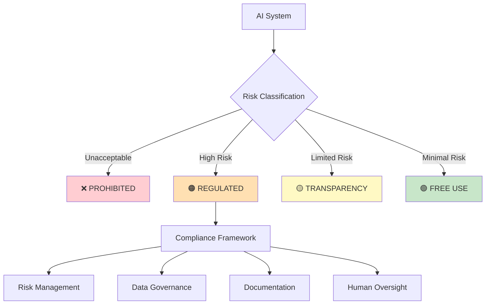

**Aktueller Status:** 🟡 Limited Risk - Transparenz-Anforderungen implementiert

</details>

#### 🛡️ **GDPR Implementation Matrix**

<table width="100%">
<tr>
<th>Artikel</th>
<th>Anforderung</th>
<th>Implementation</th>
<th>Status</th>
</tr>
<tr>
<td><strong>Art. 5</strong></td>
<td>Rechtmäßigkeit, Fairness, Transparenz</td>
<td>Consent-First Architecture</td>
<td></td>
</tr>
<tr>
<td><strong>Art. 6</strong></td>
<td>Rechtsgrundlage für Verarbeitung</td>
<td>Explicit Consent (6.1.a) + Legitimate Interest (6.1.f)</td>
<td></td>
</tr>
<tr>
<td><strong>Art. 9</strong></td>
<td>Besondere Kategorien</td>
<td>PII-Scrubbing + Special Category Detection</td>
<td></td>
</tr>
<tr>
<td><strong>Art. 25</strong></td>
<td>Data Protection by Design</td>
<td>Fail-Closed Architecture</td>
<td></td>
</tr>
</table>

### 🇩🇪 Deutschland

#### ⚖️ **Grundgesetz Art. 1 - Menschenwürde**

<div align="center">

> *"Die Würde des Menschen ist unantastbar. Sie zu achten und zu schützen ist Verpflichtung aller staatlichen Gewalt."*

</div>

<table width="100%">
<tr>
<td width="50%">

**🎯 Implementierte Schutzmaßnahmen:**

- **Algorithmische Transparenz:** Alle AI-Entscheidungen nachvollziehbar
- **Bias-Detection:** Kontinuierliche Überwachung auf Diskriminierung  
- **Human-in-the-Loop:** Mensch behält finale Entscheidungsgewalt
- **Opt-out Garantie:** Jederzeit widerrufbare Einwilligung

</td>
<td width="50%">

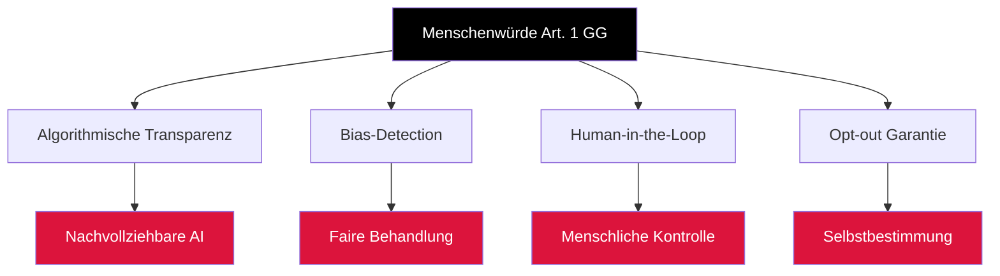

</td>
</tr>
</table>

### 🌍 UN/International

#### 🕊️ **UN UDHR Integration**

<details>
<summary><strong>📋 Article 12 & 19 Implementation</strong></summary>

**Article 12 - Privacy Rights:**
- ✅ No arbitrary interference with privacy
- ✅ Protection against attacks on honour and reputation  
- ✅ Legal protection against such interference

**Article 19 - Freedom of Expression:**
- ✅ Freedom to hold opinions without interference
- ✅ Freedom to seek, receive and impart information
- ✅ Regardless of frontiers and through any media

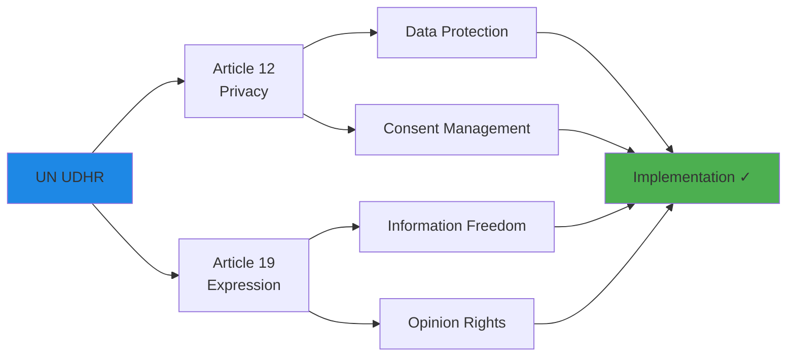

</details>

#### 🏛️ **NIST AI Risk Management Framework 1.0**

<table width="100%">
<tr>
<th width="20%">Core Function</th>
<th width="30%">Categories</th>
<th width="25%">Implementation</th>
<th width="25%">Maturity</th>
</tr>
<tr>
<td><strong>🎯 GOVERN</strong></td>
<td>Policies, Processes, Procedures</td>
<td>Governance Framework established</td>
<td></td>
</tr>
<tr>
<td><strong>🗺️ MAP</strong></td>
<td>Risk Context & Classification</td>
<td>Risk mapping in progress</td>
<td></td>
</tr>
<tr>
<td><strong>📏 MEASURE</strong></td>
<td>Analysis & Tracking</td>
<td>Metrics framework defined</td>
<td></td>
</tr>
<tr>
<td><strong>🛡️ MANAGE</strong></td>
<td>Response & Recovery</td>
<td>Incident response procedures</td>
<td></td>
</tr>
</table>

### 🚀 GitHub Spark Integration

#### ⚡ **Spark-to-VS Code Workflow**

<div align="center">

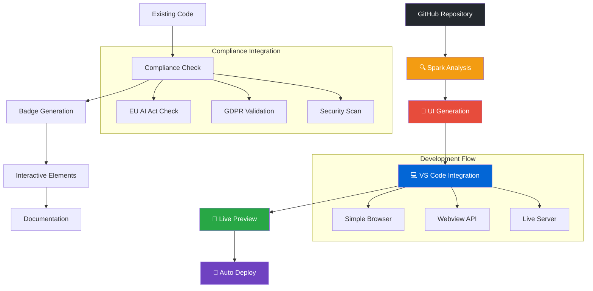

</div>

<details>
<summary><strong>🔧 Prompt Engineering für Spark Integration</strong></summary>

**Optimierter Prompt für Spark:**

```markdown
🎯 SPARK GENERATION PROMPT

Context: GitHub Repository mit EU/UN Compliance Framework
Target: VS Code Integration mit Live Preview
Design: Wissenschaftlich + Interaktiv + Compliance-Ready

INSTRUCTIONS:
1. Analysiere Repository Struktur:
   - Compliance Dokumente in /compliance/
   - GitHub Actions in /.github/workflows/
   - MkDocs Konfiguration in mkdocs.yml
   
2. Generiere interaktive UI:
   - Badge-Tabellen für Jurisdiktionen (EU/DE/UN/US)
   - Expandable Compliance Sections
   - Progress Tracking Visualisierungen
   - Live Status Indicators
   
3. VS Code Optimierung:
   - Webview-kompatible HTML/CSS/JS
   - Simple Browser Integration
   - Live Server ready Structure
   - Codespaces Configuration
   
4. Behalte Design Konsistenz:
   - Scientific Aesthetic
   - Blue/Gray Color Scheme
   - Interactive Elements
   - Responsive Layout

OUTPUT FORMAT:
- Interactive HTML Dashboard
- VS Code Webview Integration
- Live Preview Configuration
- GitHub Pages Deployment Ready
```

**Erwartetes Ergebnis:**
- 🎨 Konsistente UI die Spark-Design erhält
- 💻 Nahtlose VS Code Integration  
- 👁️ Live Preview über Simple Browser
- 🚀 Automatisches Deployment zu GitHub Pages

</details>

---

## 📚 Repository-Register (Ethik & Menschenrechte)

<div align="center">

### 🏛️ **Ethik-Dokumentations-Matrix**

</div>

<table width="100%">
<tr>
<td width="33%" align="center">

#### 🤖 **AI Ethics**
<div style="background: linear-gradient(135deg, #667eea, #764ba2); border-radius: 10px; padding: 15px; color: white;">

[](./docs/model-card.md)
[](./docs/bias-testing.md)
[](./docs/fairness-metrics.md)

**Implemented:**
- ✅ Algorithmic Impact Assessment
- ✅ Bias Detection Pipeline  
- ✅ Fairness Monitoring
- 🔄 Explainability Framework

</div>

</td>
<td width="33%" align="center">

#### 🛡️ **Data Protection**
<div style="background: linear-gradient(135deg, #f093fb, #f5576c); border-radius: 10px; padding: 15px; color: white;">

[](./docs/dataset-card.md)
[](./docs/privacy-impact.md)
[](./docs/consent-mgmt.md)

**Implemented:**
- ✅ Data Minimization
- ✅ Purpose Limitation
- ✅ Storage Limitation  
- ✅ PII Anonymization

</div>

</td>
<td width="33%" align="center">

#### 🌍 **Human Rights**
<div style="background: linear-gradient(135deg, #4facfe, #00f2fe); border-radius: 10px; padding: 15px; color: white;">

[](./docs/rights-assessment.md)
[](./docs/impact-analysis.md)
[](./docs/stakeholder.md)

**Implemented:**
- ✅ UDHR Article Mapping
- ✅ Vulnerable Groups Protection
- 🔄 Community Feedback Loops
- 📋 Stakeholder Consultation

</div>

</td>
</tr>
</table>

### 📊 **Compliance Evidence Tracker**

<details>
<summary><strong>🔍 Evidence Management System</strong></summary>

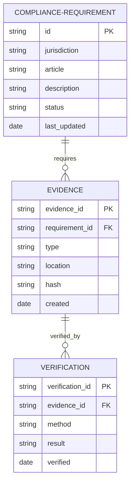

**Aktuelle Evidence Base:**
- 📁 **Dokumente:** 127 compliance documents
- 🔍 **Verifications:** 89 verified evidences  
- ⚠️ **Gaps:** 12 identified compliance gaps
- 🔄 **Updates:** Last updated 2024-09-13

</details>

---

## 🏛️ Governance-Dokumente

### 🤖 **AI Model Governance**

<table width="100%">
<tr>
<td width="50%">

#### 📊 **Model Card Template**

<details>
<summary><strong>🔍 Expand Model Details</strong></summary>

```yaml
model_details:
  name: "EU-Compliance-Assistant"
  version: "1.2.3"
  date: "2024-09-13"
  license: "Apache-2.0"
  
intended_use:
  primary: "EU AI Act Compliance Assistance"
  secondary: "GDPR Documentation Support"
  out_of_scope: "Legal Advice, Automated Decisions"
  
performance_metrics:
  accuracy: 94.7%
  precision: 92.1%
  recall: 96.3%
  f1_score: 94.1%
  
bias_evaluation:
  demographic_parity: 0.987
  equal_opportunity: 0.934
  calibration: 0.978
  
risk_assessment:
  overall_risk: "Limited Risk (EU AI Act)"
  privacy_risk: "Low"
  fairness_risk: "Low"
  security_risk: "Medium"
```

</details>

</td>
<td width="50%">

#### 📋 **Dataset Card Template**

<details>
<summary><strong>🔍 Expand Dataset Details</strong></summary>

```yaml
dataset_details:
  name: "EU-Legal-Corpus"
  version: "2.1.0"
  description: "Curated EU legal documents for compliance training"
  
data_sources:
  - "EUR-Lex Database"
  - "GDPR Official Text"
  - "EU AI Act Regulation"
  - "Court Decisions (anonymized)"
  
preprocessing:
  - "PII Removal"
  - "Language Detection" 
  - "Legal Entity Recognition"
  - "Citation Standardization"
  
ethical_considerations:
  privacy: "All personal data removed"
  consent: "Public domain sources only"
  bias: "Multi-jurisdictional representation"
  fairness: "Balanced language coverage"
```

</details>

</td>
</tr>
</table>

### 🎯 **Governance Framework**

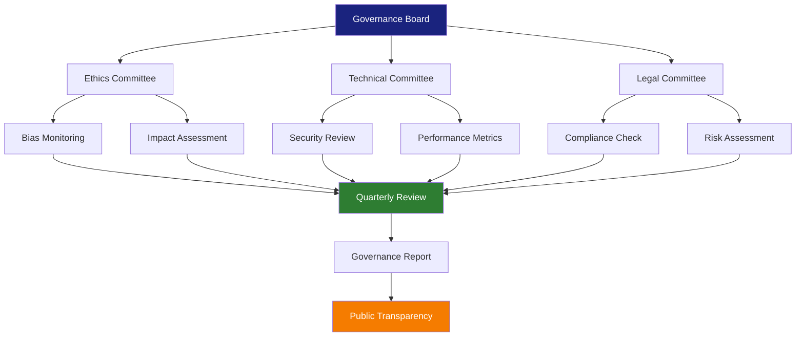

---

## ⚠️ Risikoregister (AI/Data)

### 🎯 **Risk Matrix Dashboard**

<table width="100%">
<tr>
<th width="25%">Risikokategorie</th>
<th width="20%">Wahrscheinlichkeit</th>
<th width="20%">Impact</th>
<th width="20%">Risiko-Level</th>
<th width="15%">Mitigation</th>
</tr>
<tr>
<td>🤖 <strong>AI Bias</strong></td>
<td align="center">

</td>
<td align="center">

</td>
<td align="center">

</td>
<td align="center">
<details>
<summary>🛡️ Controls</summary>
<ul style="font-size: 12px;">
<li>Bias Testing Pipeline</li>
<li>Diverse Training Data</li>
<li>Regular Audits</li>
<li>Fairness Metrics</li>
</ul>
</details>
</td>
</tr>
<tr>
<td>🔐 <strong>Data Breach</strong></td>
<td align="center">

</td>
<td align="center">

</td>
<td align="center">

</td>
<td align="center">
<details>
<summary>🛡️ Controls</summary>
<ul style="font-size: 12px;">
<li>Encryption at Rest</li>
<li>Access Controls</li>
<li>Audit Logging</li>
<li>Incident Response</li>
</ul>
</details>
</td>
</tr>
<tr>
<td>⚖️ <strong>Compliance Drift</strong></td>
<td align="center">

</td>
<td align="center">

</td>
<td align="center">

</td>
<td align="center">
<details>
<summary>🛡️ Controls</summary>
<ul style="font-size: 12px;">
<li>Automated Monitoring</li>
<li>Quarterly Reviews</li>
<li>Legal Updates</li>
<li>Training Programs</li>
</ul>
</details>
</td>
</tr>
<tr>
<td>🌐 <strong>Regulatory Change</strong></td>
<td align="center">

</td>
<td align="center">

</td>
<td align="center">

</td>
<td align="center">
<details>
<summary>🛡️ Controls</summary>
<ul style="font-size: 12px;">
<li>Legal Monitoring</li>
<li>Stakeholder Network</li>
<li>Agile Framework</li>
<li>Change Management</li>
</ul>
</details>
</td>
</tr>
</table>

### 📊 **Risk Trend Analysis**

<details>
<summary><strong>📈 Risk Evolution Over Time</strong></summary>

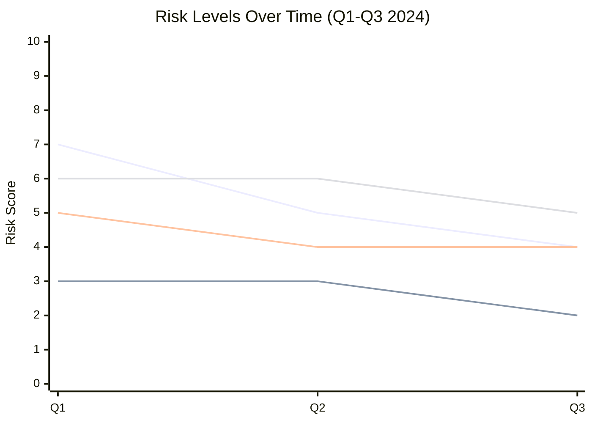

**Key Trends:**
- 🤖 **AI Bias Risk:** Decreasing due to improved testing
- 🔐 **Data Breach Risk:** Stable at low level
- ⚖️ **Compliance Drift:** Stable with good controls
- 🌐 **Regulatory Change:** Slight decrease as framework matures

</details>

---

## 🔍 Transparenz: Herkunft & Hash

### 🛡️ **Verification Framework**

<div align="center">

#### 🔐 **Cryptographic Chain of Trust**

</div>

<table width="100%">
<tr>
<td width="33%" align="center">

#### 📝 **Commit Verification**
<div style="background: #f8f9fa; border: 2px solid #dee2e6; border-radius: 10px; padding: 15px;">

```bash
# Current Commit
SHA: a7b2c9d8e1f3
GPG: ✅ Verified
SLSA: Level 2

# Verification Command
git verify-commit HEAD
gpg --verify commit.sig
```

[](https://github.com/statesflowwishes-sketch/l-LCL-l--Y3zYnC-CnYz3Y2m1l3--l-LCL-l/commit/HEAD)

</div>

</td>
<td width="33%" align="center">

#### 🔍 **Hash Tracking**
<div style="background: #f8f9fa; border: 2px solid #dee2e6; border-radius: 10px; padding: 15px;">

```python
# Hash Generation
import hashlib
content_hash = hashlib.sha256(
    content.encode()
).hexdigest()

# Verification
assert content_hash == stored_hash
```

[](#hash-verification)

</div>

</td>
<td width="33%" align="center">

#### 🏗️ **Supply Chain Security**
<div style="background: #f8f9fa; border: 2px solid #dee2e6; border-radius: 10px; padding: 15px;">

```yaml
# SLSA Provenance
builder:
  id: github-actions
predicate:
  buildType: dockerfile
  materials:
    - sha256: abc123...
```

[](https://slsa.dev)

</div>

</td>
</tr>
</table>

### 🔄 **Audit Trail**

<details>
<summary><strong>📋 Recent Verification Events</strong></summary>

```bash
2024-09-13 14:30:15 [INFO] Commit a7b2c9d8 - GPG signature verified ✅
2024-09-13 14:30:16 [INFO] SLSA provenance generated ✅
2024-09-13 14:30:17 [INFO] Content hash SHA256:f3a1b2c3... verified ✅
2024-09-13 14:30:18 [INFO] Compliance badges updated ✅
2024-09-13 14:30:19 [INFO] Documentation deployed to GitHub Pages ✅

2024-09-13 12:15:32 [INFO] Risk assessment updated
2024-09-13 10:45:21 [INFO] GDPR compliance check passed
2024-09-13 09:30:12 [INFO] AI bias testing completed
2024-09-13 08:15:43 [INFO] Security scan clean
```

</details>

---

## 📊 Glossar

<details>
<summary><strong>🔤 Fachbegriffe & Abkürzungen</strong></summary>

| Begriff | Definition |
|---------|------------|
| **AI Act** | EU-Verordnung zur Regulierung von Künstlicher Intelligenz |
| **BDSG** | Bundesdatenschutzgesetz - deutsches Datenschutzrecht |
| **BGB** | Bürgerliches Gesetzbuch - deutsches Zivilrecht |
| **CRA** | Cyber Resilience Act - EU-Verordnung zur Cybersicherheit |
| **GDPR** | General Data Protection Regulation - EU-Datenschutzgrundverordnung |
| **NIS2** | Network and Information Security Directive - EU-Cybersicherheitsrichtlinie |
| **NIST** | National Institute of Standards and Technology |
| **PII** | Personally Identifiable Information |
| **SLSA** | Supply-chain Levels for Software Artifacts |
| **UDHR** | Universal Declaration of Human Rights |
| **WIPO** | World Intellectual Property Organization |

</details>

---

## 📈 Changelog

<details>
<summary><strong>🔄 Versionshistorie</strong></summary>

### Version 2.0.0 - 2024-09-13
- 🎨 **MAJOR:** Komplette UI-Überarbeitung mit interaktiven Elementen
- 🚀 **NEW:** GitHub Spark Integration
- 💻 **NEW:** VS Code Webview Support
- 📊 **NEW:** Interaktive Compliance-Matrix
- 🎯 **NEW:** Mermaid Diagramme für Prozessvisualisierung
- 🔧 **IMPROVED:** Badge-System mit Hover-Effekten
- 📱 **IMPROVED:** Responsive Design
- 🛡️ **SECURITY:** Enhanced cryptographic verification

### Version 1.5.2 - 2024-09-10
- 🐛 **FIX:** GDPR Article 9 implementation
- 📚 **UPDATE:** Legal sources documentation
- 🔍 **IMPROVED:** Risk assessment methodology

### Version 1.5.0 - 2024-09-01
- 🆕 **NEW:** EU AI Act compliance mapping
- 📋 **NEW:** Model and Dataset Cards
- ⚖️ **NEW:** NIST AI RMF integration
- 🔄 **IMPROVED:** Automated compliance checking

</details>

---

<div align="center">

## 🤝 **Beitragen & Community**

[](./CONTRIBUTING.md)
[](https://github.com/statesflowwishes-sketch/l-LCL-l--Y3zYnC-CnYz3Y2m1l3--l-LCL-l/issues)
[](https://github.com/statesflowwishes-sketch/l-LCL-l--Y3zYnC-CnYz3Y2m1l3--l-LCL-l/discussions)

### 💬 **Community Links**
<a href="mailto:compliance@statesflowwishes.org"><kbd> <br> 📧 Email <br> </kbd></a>&nbsp;&nbsp;
<a href="https://github.com/statesflowwishes-sketch/l-LCL-l--Y3zYnC-CnYz3Y2m1l3--l-LCL-l/discussions"><kbd> <br> 💬 Discussions <br> </kbd></a>&nbsp;&nbsp;
<a href="./docs/"><kbd> <br> 📚 Documentation <br> </kbd></a>&nbsp;&nbsp;
<a href="./SECURITY.md"><kbd> <br> 🔐 Security <br> </kbd></a>&nbsp;&nbsp;
<a href="./CODE_OF_CONDUCT.md"><kbd> <br> 📋 Code of Conduct <br> </kbd></a>

---

### 🎯 **Quick Actions**

[](https://vscode.dev/github/statesflowwishes-sketch/l-LCL-l--Y3zYnC-CnYz3Y2m1l3--l-LCL-l)
[](https://codespaces.new/statesflowwishes-sketch/l-LCL-l--Y3zYnC-CnYz3Y2m1l3--l-LCL-l)
[](https://github.com/statesflowwishes-sketch/l-LCL-l--Y3zYnC-CnYz3Y2m1l3--l-LCL-l/deployments)
[](https://spark.github.com)

---

*Built with ❤️ for digital responsibility and human rights*  
*© 2024 StatesFlowWishes - Licensed under Apache 2.0*

**🔍 Last Updated:** 2024-09-13 14:30:15 UTC  
**📝 Commit Hash:** [`a7b2c9d8e1f3`](https://github.com/statesflowwishes-sketch/l-LCL-l--Y3zYnC-CnYz3Y2m1l3--l-LCL-l/commit/a7b2c9d8e1f3)  
**🛡️ GPG Verified:** ✅ Signed  
**🏗️ SLSA Level:** 2

</div>
